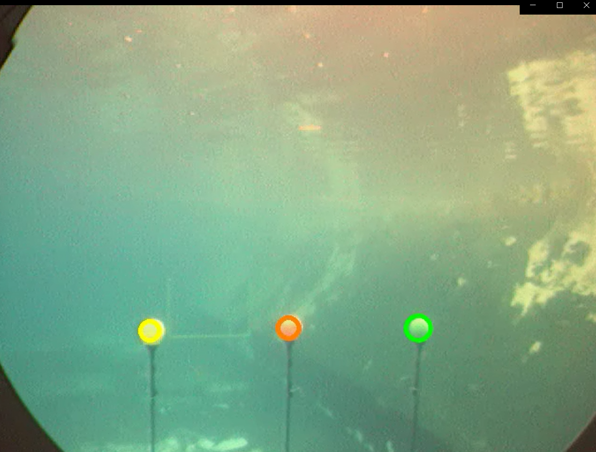

# Buoy Detection

## Introduction 

This project performs colour segmentation underwater with the use of methods like implementation of Gaussian Mixture Models and Expectation Maximization.
The video provided includes 3 colours of Yellow, Orange and Green. However, due the variation of the shades of colour in each frame, conventional techniques could not be implemented for segmentation. Thus, we use the Gaussian techniques to train the model using the data set that is generated to help the model detect the color based on the variations. 

The output images of all three colours being detected are shown along with the histograms for each colour ``outputs/Buoy_detection1.png``

The final video with the overlap of the detection frames for each colour is in ``outputs/3D_gauss.avi``

The report containing the details of the outputs and the plots is [here](https://github.com/kmushty/Buoy_Detection/blob/main/Project_3_Report.pdf) 

## Output 

